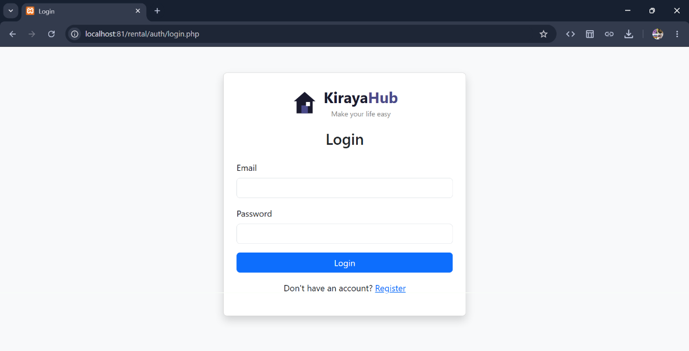
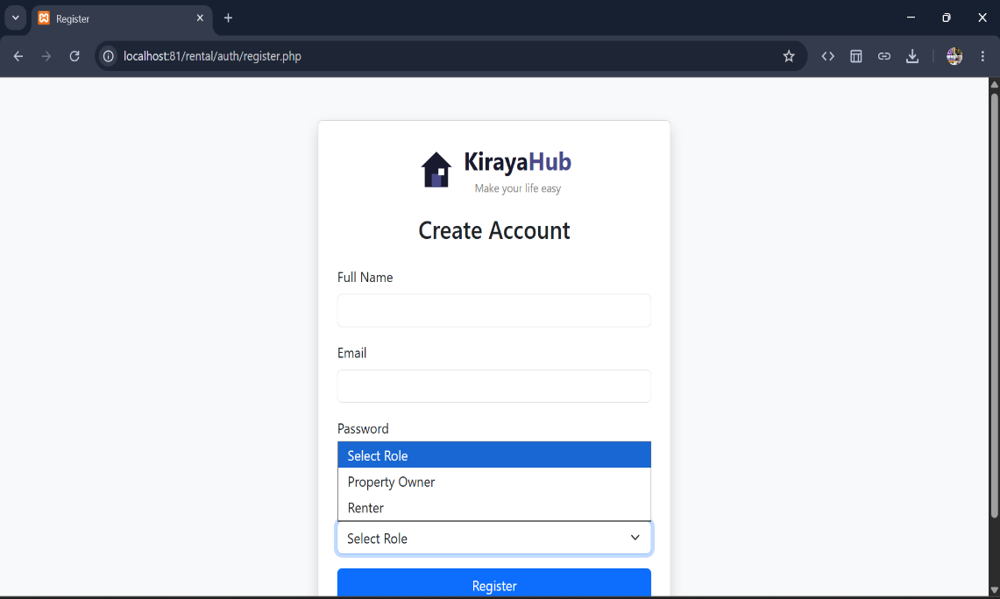
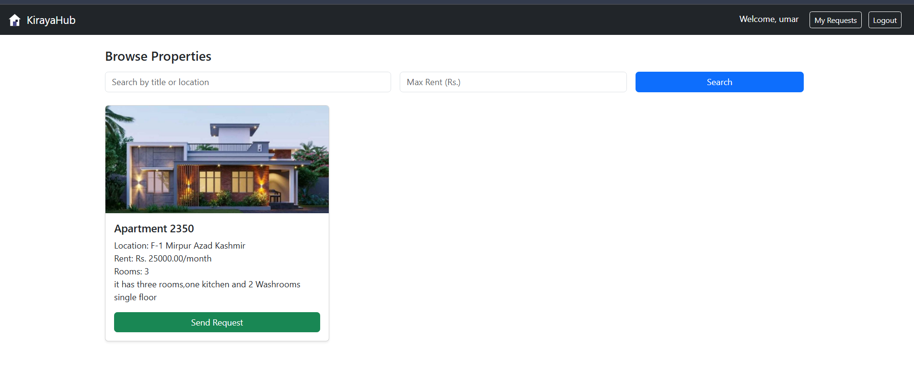
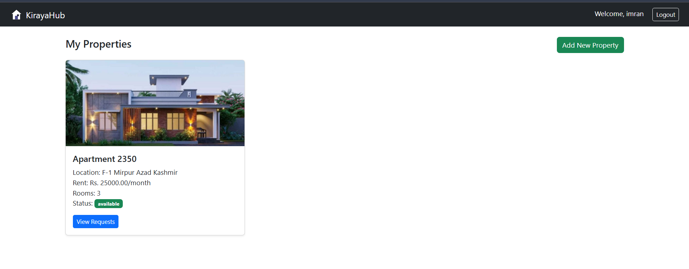
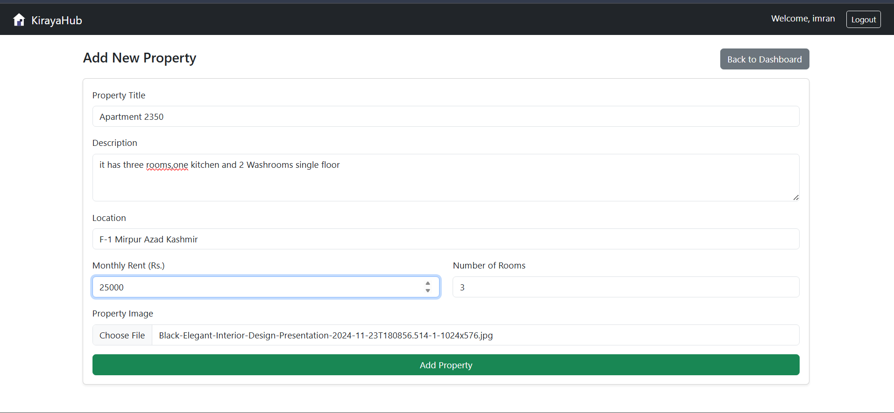
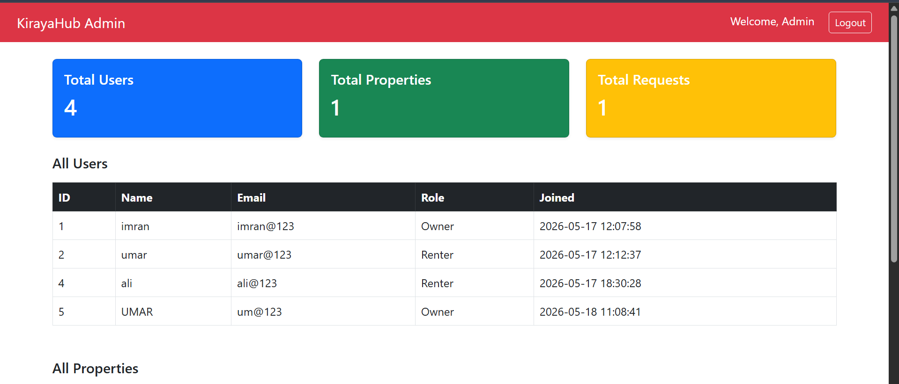
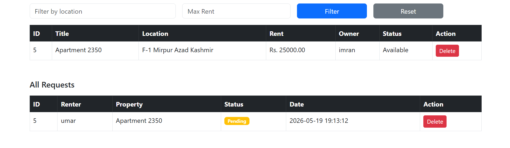

# KirayaHub - Online Property Rental System

> Make your life easy

KirayaHub is a full-stack web application that connects property owners and renters on one platform. Owners list their properties, renters browse and send requests, and a physical meeting only happens after the request is accepted.

---

## Problem It Solves

Before this system, a person looking for a rental property had to physically visit multiple areas, ask around, and rely on middlemen. This wasted time and money for both owners and renters. KirayaHub eliminates unnecessary trips by moving the entire process online.

---

## Screenshots

### Login Page


### Register Page


### Renter Dashboard


### Owner Dashboard


### Add Property


### Admin Dashboard



## Features

- **Owner**: Register, list properties with images, manage rental requests (accept/reject/update)
- **Renter**: Browse available properties, filter by location and max rent, send requests, track status
- **Admin**: View all users, filter and delete properties, delete requests, view stats

---

## Tech Stack

| Technology | Purpose |
|-----------|---------|
| PHP | Backend logic and session management |
| MySQL | Database for users, properties, requests |
| PDO | Secure database connection with prepared statements |
| Bootstrap 5 | Responsive frontend UI |
| HTML & CSS | Page structure and custom styling |
| XAMPP | Local development environment |

---

## Project Structure

```
rental/
├── config/
│   └── db.php                  # Database connection
├── auth/
│   ├── register.php            # User registration
│   ├── login.php               # User login
│   └── logout.php              # User logout
├── owner/
│   ├── dashboard.php           # Owner property listing
│   ├── add_property.php        # Add new property
│   └── requests.php            # Manage rental requests
├── renter/
│   ├── dashboard.php           # Redirects to browse
│   ├── browse.php              # Browse and filter properties
│   └── my_requests.php         # Track request status
├── admin/
│   └── dashboard.php           # Admin panel
├── uploads/                    # Property images stored here
└── index.php                   # Entry point
```

---

## Installation & Setup Guide

### Step 1: Install XAMPP

Download and install XAMPP from [https://www.apachefriends.org](https://www.apachefriends.org)

Start **Apache** and **MySQL** from the XAMPP Control Panel.

---

### Step 2: Clone or Download the Project

Place the project folder inside:

```
C:/xampp/htdocs/rental/
```

Make sure the folder name is exactly `rental`.

---

### Step 3: Create the Database

Open your browser and go to:

```
localhost/phpmyadmin
```

Click **New** on the left side and create a database named:

```
rentaldb
```

Select the database, click the **SQL** tab, and run these queries:

```sql
CREATE TABLE users (
    id INT PRIMARY KEY AUTO_INCREMENT,
    name VARCHAR(100) NOT NULL,
    email VARCHAR(100) NOT NULL UNIQUE,
    password VARCHAR(255) NOT NULL,
    role VARCHAR(10) NOT NULL,
    created_at TIMESTAMP DEFAULT CURRENT_TIMESTAMP
);

CREATE TABLE properties (
    id INT PRIMARY KEY AUTO_INCREMENT,
    user_id INT NOT NULL,
    title VARCHAR(150) NOT NULL,
    description TEXT,
    location VARCHAR(150) NOT NULL,
    rent DECIMAL(10,2) NOT NULL,
    rooms INT NOT NULL,
    contact VARCHAR(15) NOT NULL,
    image VARCHAR(255),
    status VARCHAR(20) DEFAULT 'available',
    created_at TIMESTAMP DEFAULT CURRENT_TIMESTAMP,
    FOREIGN KEY (user_id) REFERENCES users(id)
);

CREATE TABLE requests (
    id INT PRIMARY KEY AUTO_INCREMENT,
    property_id INT NOT NULL,
    renter_id INT NOT NULL,
    owner_id INT NOT NULL,
    status VARCHAR(20) DEFAULT 'pending',
    created_at TIMESTAMP DEFAULT CURRENT_TIMESTAMP,
    FOREIGN KEY (property_id) REFERENCES properties(id),
    FOREIGN KEY (renter_id) REFERENCES users(id),
    FOREIGN KEY (owner_id) REFERENCES users(id)
);
```

---

### Step 4: Create Admin Account

Still in the SQL tab, run this query to create the admin account:

```sql
INSERT INTO users (name, email, password, role)
VALUES ('Admin', 'admin@kirayahub.com', '$2y$10$TKh8H1.PfunDb5Jlm1c2eucenMUbXfYCOIrFvQZVQiKiRmCEJZKK6', 'admin');
```

Admin login credentials:
- **Email**: admin@kirayahub.com
- **Password**: password

To change the admin password, create a file `reset_admin.php` in the rental folder:

```php
<?php
require_once 'config/db.php';
$hash = password_hash('your_new_password', PASSWORD_DEFAULT);
$stmt = $pdo->prepare("UPDATE users SET `password` = ? WHERE email = 'admin@kirayahub.com'");
$stmt->execute([$hash]);
echo "Password updated.";
?>
```

Run it once at `localhost/rental/reset_admin.php` then delete the file.

---

### Step 5: Run the Project

Open your browser and go to:

```
localhost/rental
```

You will be redirected to the login page automatically.

---

## How to Use

### As an Owner

1. Go to `localhost/rental` and click **Register**
2. Fill in your details and select **Property Owner** as your role
3. Login with your credentials
4. Click **Add New Property** and fill in the property details with an image
5. View incoming requests under **View Requests** on each property card
6. Accept or reject any request

### As a Renter

1. Register and select **Renter** as your role
2. Login and browse available properties
3. Use the search bar or max rent filter to find suitable properties
4. Click **Send Request** on any property you like
5. Go to **My Requests** to track the status of your requests

### As Admin

1. Login with admin credentials
2. View total stats on the dashboard
3. Browse all users, properties, and requests
4. Filter properties by location or max rent
5. Delete any property or request if needed

---

## Security Features

- Passwords are hashed using bcrypt - plain text is never stored
- Session-based authentication on every protected page
- Role-based access control - owners cannot access renter pages and vice versa
- Cache headers prevent back button access after logout
- Prepared statements prevent SQL injection
- Duplicate request prevention per renter per property
- File type validation for image uploads (jpg and png only)
- Unique filenames using `uniqid()` to prevent file overwriting

---

## Notes

- The `uploads/` folder must exist and be writable for image uploads to work
- Only one admin account exists - it cannot be created through the registration form
- To test with two accounts simultaneously, use one normal browser window and one incognito window


